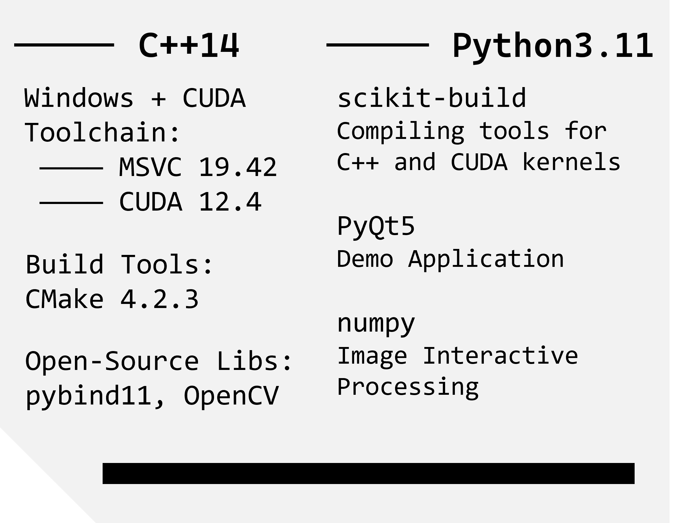
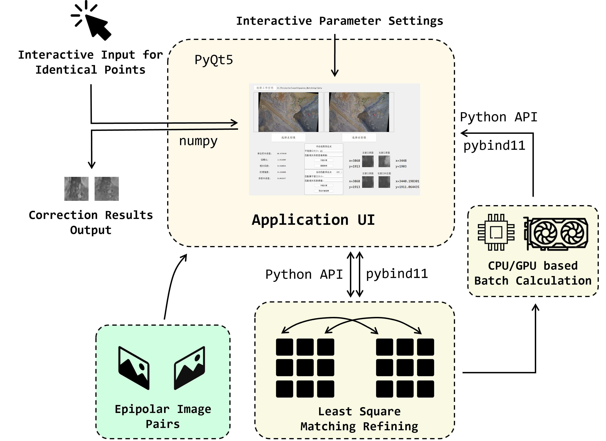
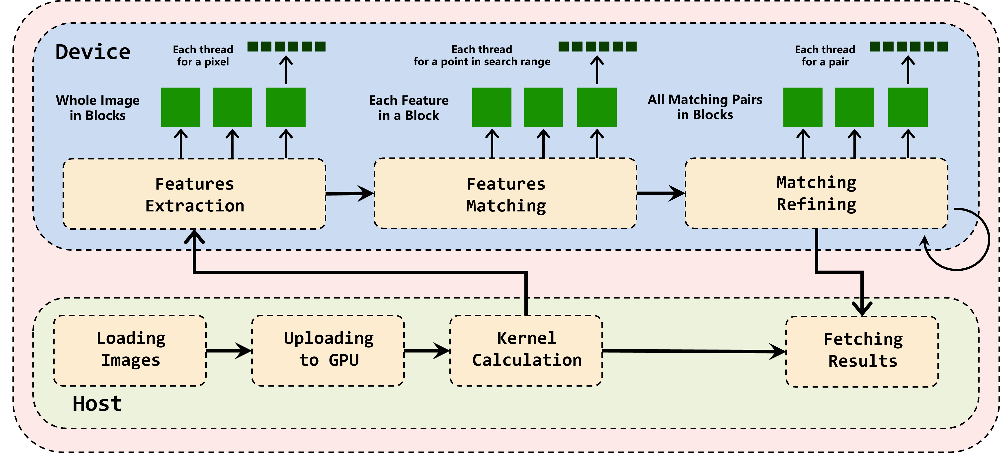

# G-LSMEI: GPU-Accelerated Least-Square Matching Refiner for Epipolar Image Pairs
[](https://github.com/DonaldTrump-coder/LeastSquares_Matching/)
[](https://github.com/DonaldTrump-coder/LeastSquares_Matching/)
[](http://www.apache.org/licenses/)

<br>
A project of the sub-pixel Least-Square Matching Refining Algorithm for **Epipolar-Rectified Stereo Image Pairs** in window-size areas. The classic alogorithm is proposed by Ackermann (1984), where the correspondence search reduces to a one-dimensional problem along epipolar lines, enabling both fast convergence and high accuracy.<br>
We provide the source code in C++ and a Python API library build upon it. A PyQt Demo Application and the CUDA-based GPU-accleated version is also provided.<br>
Up to now we have successfully tested the C++ and Python on *Windows 10* and *Windows 11*.<br><br>
**Contributors**: [Haojun Tang](https://donaldtrump-coder.github.io/), [Jiahao Zhou](https://github.com/Jeiluo)<br>
**Acknowledgements**: Thanks to the guidance of [Yunsheng Zhang](https://faculty.csu.edu.cn/zhangyunsheng1/zh_CN/index.htm) from [Central South University](https://www.csu.edu.cn/)

## About the Project
### Environment


### Application Structure


### CUDA Executions


## Some Results
### Matching Results
|Left Image|Right Image|
|:--:|:--:|
|||

### Time Costs
|Setups| CPU | GPU |
|:-------:|:-------:|:-------:|
|Time(s)| 332.27 | 0.621 |

Improved by 500+ times!

## Core Algorithm tested in C++ (only CPU-based)
**What you need?**<br>
MSVC Compiler, CMake, and the source code:
```
git clone https://github.com/DonaldTrump-coder/G-LSMEI --recursive
```

**3. Build for the Code**<br>
In the project directory, run the following commands:<br>
```
mkdir build
cd build
cmake .. -G "Visual Studio 17 2022"
cmake --build . --config Release
.\Release\leastsquares_matching.exe
```
The output is from the main function in `core\src\test.cpp`

## Image Matching Application Deployment
### Windows
You also need MinGW-w64 and CMake. Install them as mentioned above!<br><br>
**1. Install the Requirement Packages for Python**<br>
In the project directory, run<br>
```
conda create -n matching python=3.11
conda activate matching
pip install -r requirements.txt
```

**2. Build the C++ Source for Application**<br>
```
cd python
python setup.py bdist_wheel
python -m pip install (Get-ChildItem dist\lsmatching-*.whl).FullName --force-reinstall
cd ..
```
Then the install of C++ Source of Least-Square Matching is done.<br><br>
**3. Use the Application in Python**<br>
run
```
python main.py
```

## Citation
If you use this project in your research, please cite:
```bibtex
@misc{LSMTang2025,
  title        = {Least-Square Matching for Image Pairs},
  author       = {Haojun Tang and Jiahao Zhou},
  year         = {2025},
  publisher    = {GitHub},
  journal      = {GitHub repository},
  howpublished = {\url{https://github.com/DonaldTrump-coder/LeastSquares_Matching}},
  note         = {Apache License 2.0}
}
```
